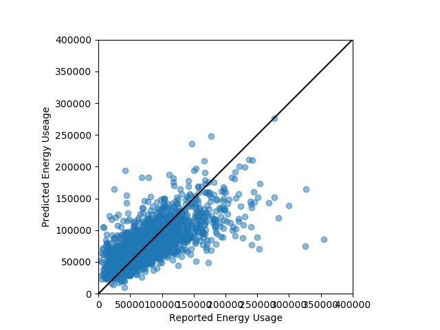

# Green Plan-it

## Motivation 
This tool is intended to be used as a way of estimating the energy usage for a structure.  There are a series of questions that need to be answered in a CSV file.  These responses are read in and parsed by the tool and an estimated energy usage is returned.

The model is based on data from the 2009 Residential Energy Consumption Survey (https://www.eia.gov/consumption/residential/data/2009/index.php?view=microdata).  This data contail over 10,000 stuctures ranging from 100 sq ft to over 16,000 sq ft. 

## Model Features
The model was trained on a subset of features.  The input CSV can be found at green_plan_it_input.csv.  There is a description of the variables that need to be provided as well as an example structure.

The model is a linear regression with which minimized Huber loss.  This was done to minimize the impact of the points at high energy usage which were not predicted well.  It is expected that these points were the result of omitted variables.  The questionaire was not inclusive of all possible energy expendatures and some were missed (i.e. owning an electric car). 

Structures which had a home buisiness and structures which heated secondary structures were removed from the database.  This was done to improve the performance of the model for a more typical structure.

## Model Execution
To execute the model the model.py file should be executed.  This will produce the following files:
* pipe_model.p
* results.png
* TOTSQFT.png
* ACROOMS.png

The pipe model is a pipe which can be used to make predictions.  To change what plots are produced the model.py file should be modified.  The model in the base directory is based on a test train split to judge model performance.  The model in the website directory is based on all of the data to make the best prediction possible.

## Model Performance
The comparison of the model predictions to the actual reported values is provided below.  As can be seen in the figure most of the houses are predicted well, except for structures that have a high energy usage.  It is expected that these houses had some additional energy usage that was not captured by the questionaire.

 

The model performed well.  There are several structures with higher reported energy usage that the model was not able to predict well.  After looking into these points it is theorized that these points are a result of omitted variables.  To achieve these high energy usages it is assumed that these households are doing non-standard activites that are not captured by the questionaire.

## Set up

### Libraries
Python 2.7

numpy 1.13.3

pandas 0.20.3

Flask 0.12.2

scikit-learn 0.19.1

Werkzeug 0.12.2

scipy 1.0.0
